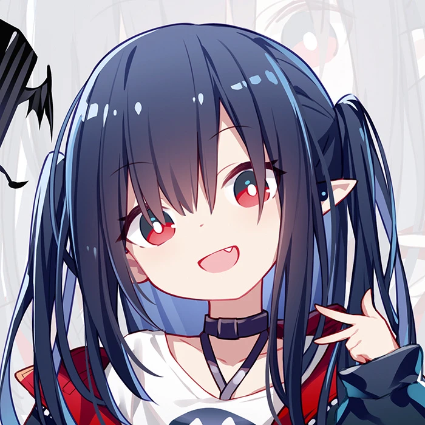

# ClosureShop

 

    
    

    

    
    
    

 

[简体中文](README.md)  | [English](README_EN.md) 

Java Web课程的项目, 项目名字来自明日方舟:stuck_out_tongue_closed_eyes::stuck_out_tongue_closed_eyes::stuck_out_tongue_closed_eyes:

画师:  \_QuAn\_ (侵删)

 

 

## 功能特性

<!-- 描述该项目的核心功能点 -->
 

## 文件结构(可选)
<!-- 可以描述下文件的结构 -->
 

## 软件架构(可选)

<!-- 可以描述下项目的架构 -->
 

## 系统架构(可选)

<!-- 可以描述下项目的架构 -->

 

## 快速开始

### 依赖检查

<!-- 描述该项目的依赖，比如依赖的包、工具或者其他任何依赖项 -->
 

### 构建

<!-- 描述如何构建该项目 -->
 

### 运行

<!-- 描述如何运行该项目 -->
 

## 使用指南

<!-- 描述如何使用该项目 -->
 

## 如何贡献

<!-- 告诉其他开发者如果给该项目贡献源码 -->
 

## 社区(可选)

<!-- 如果有需要可以介绍一些社区相关的内容 -->
 

## 关于作者

<!-- 这里写上项目作者 -->
 

## TODO（可选）
<!-- 接下来的开发/维护计划。 -->
 

## 谁在用(可选)

<!-- 可以列出使用本项目的其他有影响力的项目，算是给项目打个广告吧 -->
 

## 版本更新记录
| 版本   | 日期       | 修改者 | 备注 |
| ------ | ---------- | ------ | ---- |
| v1.1.4 | 2020-09-30 | xxx    |      |
| v1.2.0 | 2021-05-01 | xxx    |      |
| v1.2.3 | 2021-06-23 | xxx    |      |
|     |            |        |      |

## 许可证

MPL 2.0
